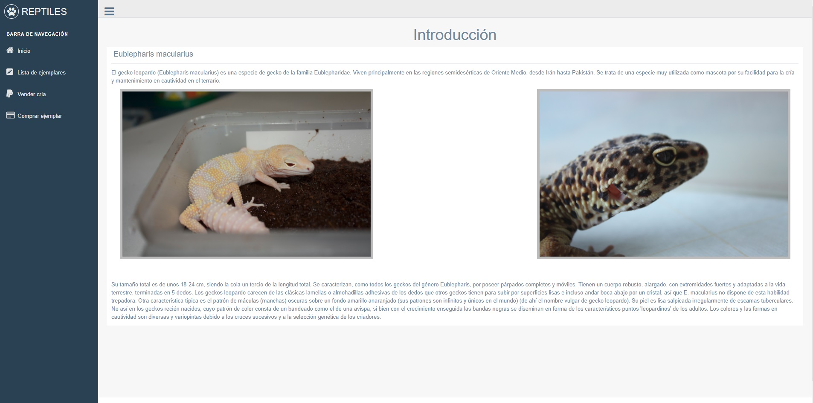
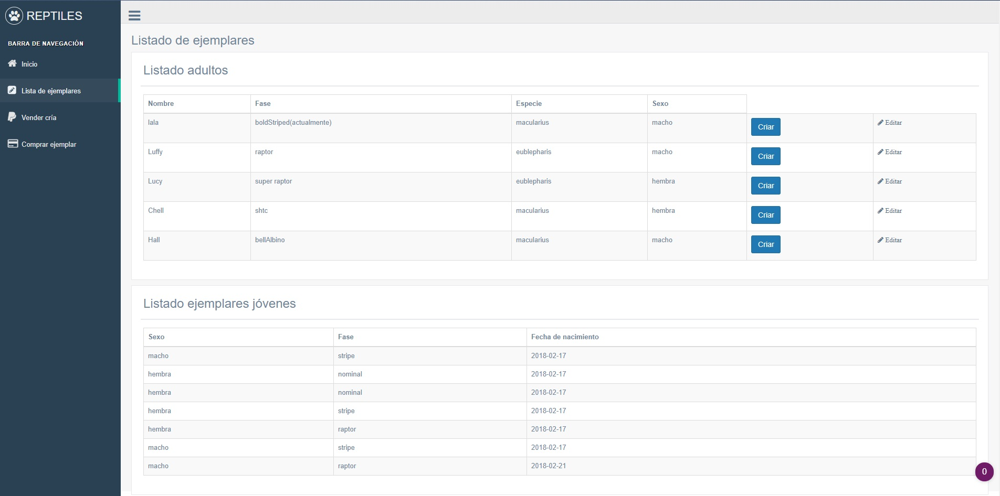
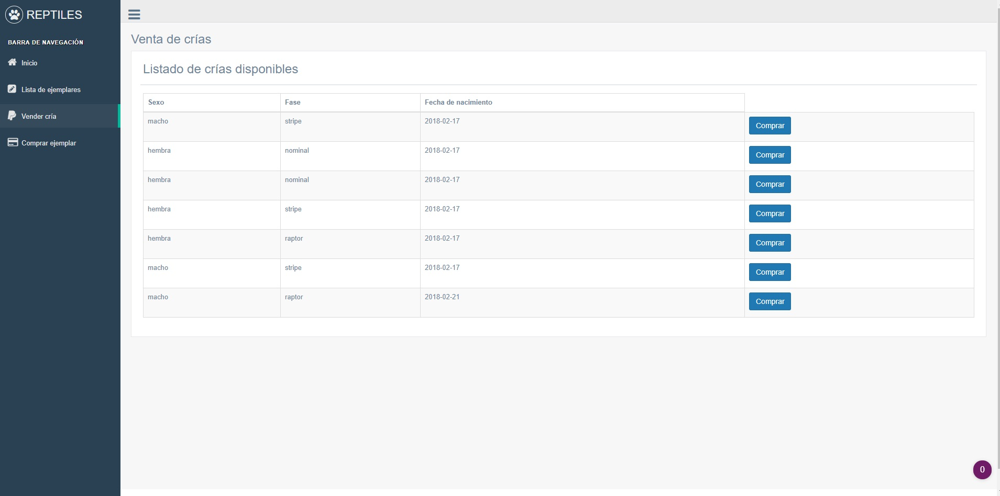
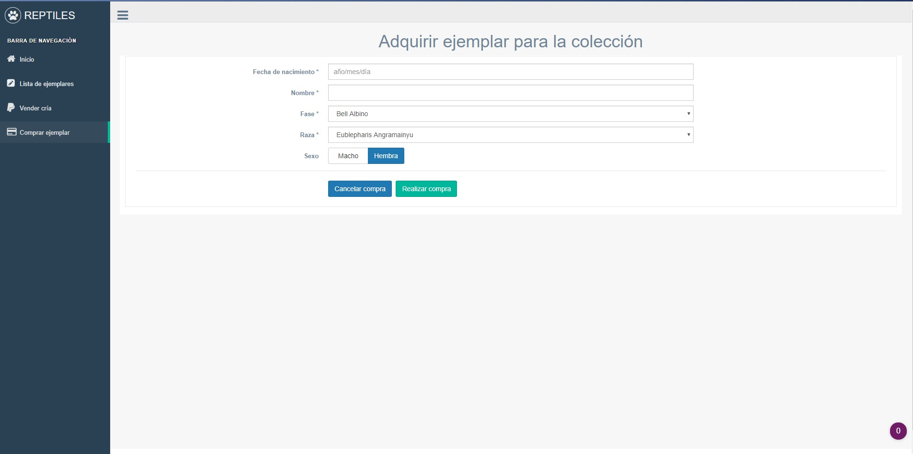

# ----TRABAJO CRUD----
## Información
-**Tema :** Crianza y venta de crías de reptilesV2.
El trabajo constará de una base de datos con 4 tablas :
- Ficha Gecko
  - Código
  - Fase
  - Especie
  - Sexo
  - Nombre
  - Fecha de nacimiento
- Ficha crías
  - Código
  - Fase
  - Sexo
  - Estado
  - Propietario
- Ficha comprador
  - Código
  - Nombre
  - Apellidos
  - DNI
- Ficha de facturas
  - código comprador
  - código cría
  - códifo factura
  - Fecha de factura

### Imágenes

### Hashmap y Arralist
	- Hashmap implementado en el login de la página web.
	- Arraylist implementado en "ComprarEjemplar".

